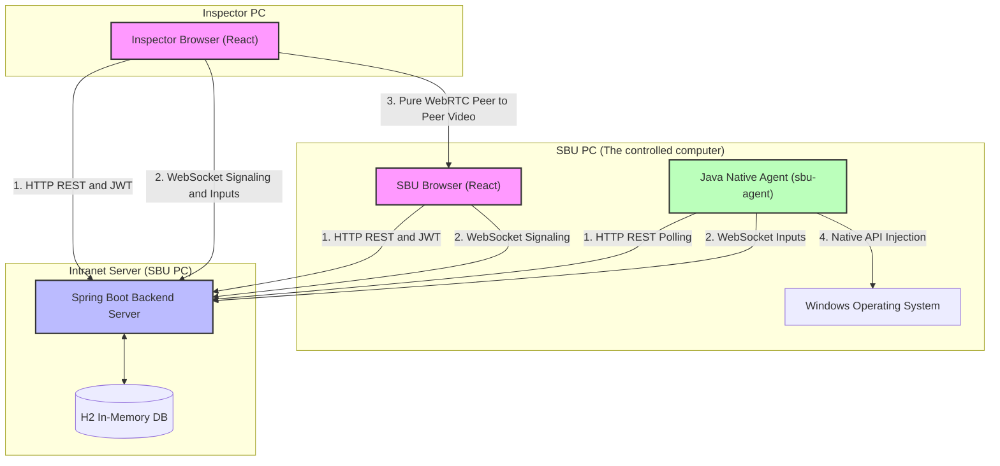
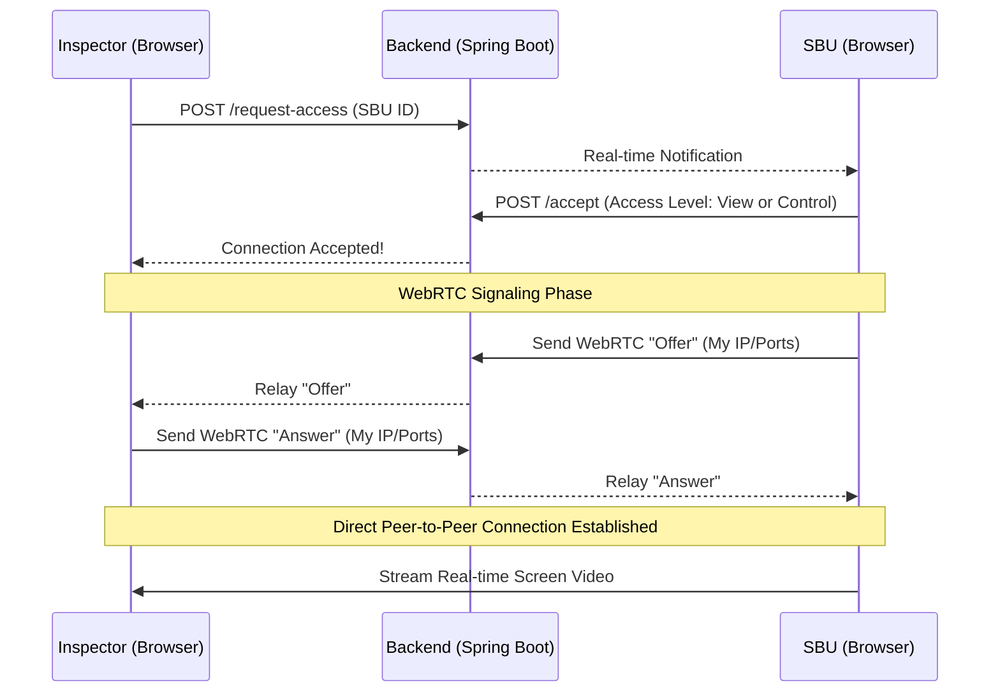
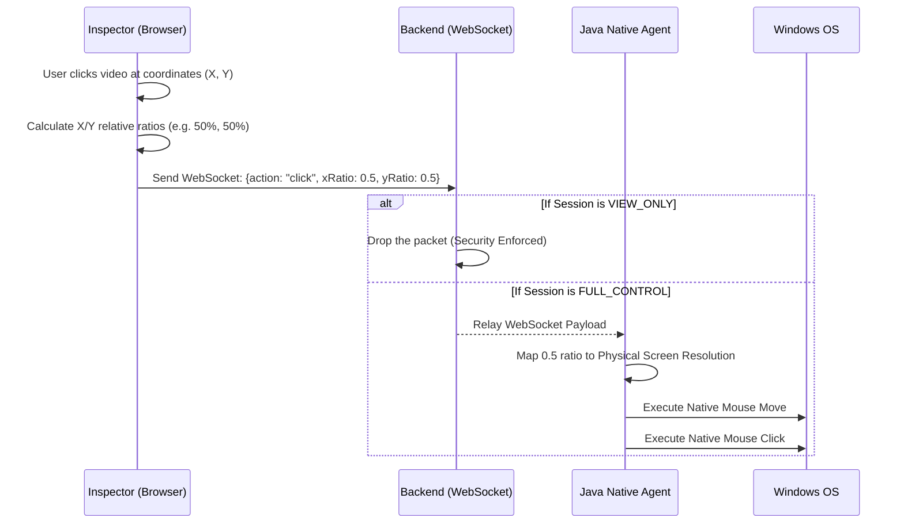

# Intranet Remote Inspection System
**Technical Architecture & System Flow Documentation**

---

## 1. Executive Overview
The Intranet Remote Inspection System is a highly secure, 100% offline remote administration and screen-sharing application designed for strict corporate intranet environments. It allows an "Inspector" (Manager) to view and control a subordinate's "SBU" (Station) securely over a local area network without requiring internet access or third-party cloud servers.

It enforces strict permission-based security: the Inspector cannot connect without the SBU explicitly accepting the connection request and selecting the desired access level (View Only vs. Full Control).

## 2. Technology Stack
The system is built using modern, enterprise-grade technologies divided into three isolated components:

### Frontend (Web Dashboard)
* **Framework:** React 18, Vite
* **UI Library:** Material-UI (MUI)
* **Media Streaming:** WebRTC (Peer-to-Peer Video/Audio)
* **Networking:** Standard `fetch` API, native WebSockets

### Backend (Signaling & API Server)
* **Framework:** Java 21, Spring Boot 3
* **Security:** Spring Security with stateless JWT (JSON Web Tokens)
* **Realtime:** Spring WebSockets (for chat, commands, and WebRTC signaling)
* **Database:** H2 Embedded In-Memory Database (Zero-setup portability)

### Native Desktop Agent (OS Controller)
* **Language:** Java 21
* **Core Library:** `java.awt.Robot` (for native OS mouse/keyboard injection)
* **Networking:** Java 11+ native `HttpClient` & `WebSocket`

---

## 3. System Architecture Diagram

This diagram illustrates the high-level infrastructure and how the three main components communicate.

---

## 4. Core Workflows (Flow Charts)

### A. Session Establishment Flow
Because the system uses WebRTC for high-speed video streaming, the two browsers must find each other on the network. The Spring Boot backend acts purely as a "Signaling Server" to introduce them.

### B. Remote Control Flow (Full Control Mode)
When the Inspector interacts with the video feed, the system translates those browser events into physical Windows OS actions.

---

## 5. Security & Limitations

### Built-in Security Features
* **Explicit Consent:** An Inspector can never silently spy on an SBU. The SBU must click "Accept".
* **Granular Control:** The SBU can accept the session as `VIEW_ONLY` (read-only) or `FULL_CONTROL`.
* **Server-Side Enforcement:** If a session is `VIEW_ONLY`, the Spring Boot WebSocket server actively drops hacking attempts to send mouse inputs.
* **Offline Privacy:** The WebRTC configuration uses `iceServers: []`, completely disabling external Google STUN/TURN servers. Video never leaves the building.

### Known Limitations
* **Geometry Mapping Requirements:** The Java Agent natively controls the OS by mapping coordinates to the physical monitor resolution. The SBU must select **"Entire Screen"** in the browser sharing prompt. Sharing a single "Chrome Tab" will cause the mathematical coordinate mapping to fail if they switch applications.
* **Complex Key Macros:** Basic typing and navigation (arrows, space, enter) work perfectly. However, operating system intercepts like `Ctrl+Alt+Delete` are blocked by Windows User Account Control (UAC) and cannot be simulated remotely.
